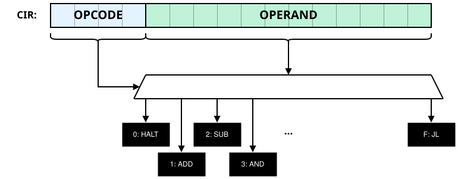
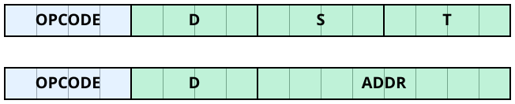

# Toy Computer & Assembler

Welcome to *Toy Computer & Assembler*, a simple virtual computer and assembler that can be used as an educational tool when introducing students to computer architecture, machine language and assembly.

*Toy Computer & Assembler* is a Python implementation of an [imaginary computer described in chapter 6](https://introcs.cs.princeton.edu/java/62toy/) of

> **Sedgewick, R. & Wayne, K. (2017)**<br>
*Computer Science: An Interdisciplinary Approach.*

that provides a simulator for the specified machine as well as a simple assembly language that targets the machine.

## Installation

Install directly from this repository (for Python ≥ 3.12):

```txt
pip install git+https://github.com/ram6ler/Toy-Computer.git@main
```


## Specifications

*Toy* has a word size of two bytes, sixteen general purpose one-word registers (named 0 to F), and 256 addressable words in memory (i.e. 512 bytes of memory). A one-byte program counter (PC) stores the address of the next instruction; a one-word current instruction register (CIR) stores the next instruction.

During decoding, the instruction is interpreted as a one-nibble *opcode* and a three-nibble *operand*. The opcode determines the circuit whose side effects are desired and the operand contains data to be sent to that circuit.



Depending on the selected circuit, the operand can be interpreted as three nibbles D, S and T, or a nibble D and a byte ADDR. (Some instructions ignore sections of the operand.)




The available machine instructions are:

| Opcode | Description     | Pseudocode            |
| :----: | :-------------- | :-------------------- |
|   0    | halt            | halt                  |
|   1    | add             | R[d] ← R[s] + R[t]    |
|   2    | subtract        | R[d] ← R[s] - R[t]    |
|   3    | bitwise and     | R[d] ← R[s] & R[t]    |
|   4    | bitwise xor     | R[d] ← R[s] ^ R[t]    |
|   5    | left shift      | R[d] ← R[s] << R[t]   |
|   6    | right shift     | R[d] ← R[s] >> R[t]   |
|   7    | load address    | R[d] ← addr           |
|   8    | load            | R[d] ← M[addr]        |
|   9    | store           | M[addr] ← R[d]        |
|   A    | load indirect   | R[d] ← M[R[t]]        |
|   B    | store indirect  | M[R[t]] ← R[d]        |
|   C    | branch zero     | if R[d] = 0 PC ← addr |
|   D    | branch positive | if R[d] > 0 PC ← addr |
|   E    | jump register   | PC ← R[d]             |
|   F    | jump & link     | R[d] ← PC; PC ← addr  |

During execution, the side effects of the selected circuit are realized, which can be helpful for solving a problem (indeed, programming is ultimately the art of expressing solutions to problems in terms of side effects that can be realized in a machine).

## Extensions

This library has extended *Toy* to allow for two's complement representation (for negative integers) and input/output functionality for more interactive projects.

### Input

Input is achieved by setting the originally unused S nibble in a load-indirect instruction (A) as follows:

|   S   | Side effect                                                                          |
| :---: | :----------------------------------------------------------------------------------- |
|   0   | Load indirect (default; same as original specification).                                                             |
|   1   | Loads a signed integer from stdin to nibble D.                                     |
|   2   | Loads an unsigned integer from stdin to nibble D.                                  |
|   3   | Writes a string as compressed ascii to memory starting at the address in nibble D. |
|   4   | Loads a random sequence of bits to nibble D.                                       |

### Output

Output is achieved by setting the originally unused S nibble in a store-indirect instruction (B) as follows:

|   S   | Side effect                                                                                      |
| :---: | :----------------------------------------------------------------------------------------------- |
|   0   | Store indirect (default; same as original specification).                                                                        |
|   1   | Writes value in nibble D to stdout as a signed denary value.                                            |
|   2   | Writes value in nibble D to stdout as an unsigned denary value.                                         |
|   3   | Writes value in nibble D to stdout as a signed binary value.                                            |
|   4   | Writes value in nibble D to stdout as an unsigned binary value.                                         |
|   5   | Writes value in nibble D to stdout as a signed octal value.                                             |
|   6   | Writes value in nibble D to stdout as an unsigned octal value.                                          |
|   7   | Writes value in nibble D to stdout as a signed hexadecimal value.                                       |
|   8   | Writes value in nibble D to stdout as an unsigned hexadecimal value.                                    |
|   9   | Writes value in nibble D to stdout as a binary pattern (e.g. for sprites).                              |
|   a   | Writes value in nibble D to stdout as ascii characters.                                                 |
|   b   | Writes a new line to stdout.                                                                     |
|   c   | Writes the string in memory starting at address in nibble D to stdout (with `\0` as terminator). |


## Machine Language

*Toy* programs can be written in machine language (as defined in S & W), which is tantamount to directly setting the PC and specifying values in memory.

### Example

Say we want to write a simple program that prompts the user for two numbers and then outputs the sum. We could break this problem up into the following steps.

1. Load a (signed) value input by the user into a register, say %1.
2. Load a second value input by the user into another register, say %2.
3. Calculate the sum of the two values and move the result into yet another register, say %3.
4. Output the sum as a signed denary expression.
5. End the program.

Putting this together (and adding some string prompts), we get:

```text
PC: 08
00: 413a
01: 2000
02: 423a
03: 2000
04: 4120
05: 2b20
06: 423a
07: 2000
08: 7000
09: b0c0
0a: a110
0b: 7002
0c: b0c0
0d: a210
0e: 1312
0f: 7004
10: b0c0
11: b310
12: b0b0
13: 0000
```

This is much easier to read if we add comments (after semicolons):

```text
; Set the PC to address 08.
PC: 08

; Some useful strings.
00: 413a; "A:"
01: 2000; " ".
02: 423a; "B:"
03: 2000; " ".
04: 4120; "A "
05: 2b20; "+ "
06: 423a; "B:"
07: 2000; " ".

; Program Start.
; Output "A: ".
08: 7000; R[0] <- 00
09: b0c0; stdout <- M[R[0]...]

; Input a value to R[1].
0a: a110; R[1] <- stdin (signed)

; Output "B: ".
0b: 7002; R[0] <- 02
0c: b0c0; stdout <- M[R[0]...]

; Input a value to R[2]
0d: a210; R[2] <- stdin (signed)

; Store the sum to R[3].
0e: 1312; R[3] <- R[1] + R[2]

; Output "A + B: "
0f: 7004; R[0] <- 04
10: b0c0; stdout <- M[R[0]...]

; Output the value in R[3].
11: b310; stdout <- R[3] (signed denary)

; Output a new line.
12: b0b0; stdout <- line

; End the program.
13: 0000; halt
```

This can be executed using by saving the machine language program as a text file *example.mc* and then running:

```sh
python -m toy_computer example.mc
```

Example run (with user input in bold):

<pre>
A: <b>10</b>
B: <b>15</b>
A + B: 25
</pre>

<pre>
A: <b>10</b>
B: <b>-15</b>
A + B: -5
</pre>

## Toy Assembly

Programs can also be written in a simple assembly language with the following expressions and instructions available:

### Comments

Comments begin with a two forward slashes (`//`).

### Memory Addresses & the PC

Unlike the case with machine language, in assembly, we don't work explicitly with the PC and memory addresses. Instead we use the **.main** mnemonic to indicate the starting address and *labels* to represent important memory addresses.

Example:

```text
// Sets the PC to the current address.
.main

// Labels the current address as "my_label".     
my_label: 
```

### Values, Registers & References

We can express values as plain numbers, which can be expressed in binary (e.g. 0b111111), octal (e.g. 0o77), denary (e.g. 63), hexadecimal (e.g. 0x3f) or as ascii (e.g. '?').

The percent sign (%) is used to indicate a register, and brackets are used to indicate the data in memory at the address in a register or a label. For example, %1 represents register 1, [%1] represents the value in memory at the address in register 1, and [my_label] represents the value in memory at the address "my_label".

### Move Operations

The *move* mnemonic is **mv** and is used to move values into a register.

Examples:

```text
// Copies value in %2 to %1.
mv %1 %2

// Copies address "my_label" to %1.     
mv %1 my_label

// Copies value 15 to %1.
mv %1 15       
```

### Load Operations

The *load* mnemonic is **ld** and is used to load values to registers from the memory.

Examples:

```text
// Loads value at address in %2 to %1.
ld %1 [%2]

// Loads value at "my_label" to %1.    
ld %1 [my_label] 
```

### Store Operations

The *store* mnemonic is **st** and is used to store values to the memory.

Examples:

```text
// Stores value in %1 to memory at address in %2.
st %1 [%2] 

// Stores value in %1 to memory at "my_label".     
st %1 [my_label]

// Stores value 15 to memory at address in %2.
st 15 [%2]

// Stores value 15 to memory at "my_label".
st 15 [my_label]
```

### Jump Operations

The *jump* mnemonics are **jz** (jump zero), **jp** (jump positive), **jn** (jump negative), **je** (jump equal) and **jmp** (jump), and are used for branching.

Examples:

```text
// Jumps to "my_label" if value in %1 is zero.
jz %1 my_label

// Jumps to "my_label" if value in %1 is positive.
jp %1 my_label

// Jumps to "my_label" if value in %1 is negative.
jn %1 my_label

// Jumps to "my_label" if values in %1 and %2 are equal.
je %1 %2 my_label

// Jumps to "my_label".
jmp my_label
```

### Call Operations

The mnemonics for *call* operations are **call** and **ret**, and are used to call subroutines from multiple points in the program.

Examples:

```text
// Saves current address to %1 and jumps to "my_label".
call %1 my_label

// Returns to address in %1.
ret %1
```

### Arithmetic and Bitwise Operations

Arithmetic and bitwise operation mnemonics are **add** (addition), **sub** (subtraction), **and** (bitwise and), **or** (bitwise or), **xor** (bitwise xor), **not** (bitwise complement), **lsh** (bitwise left-shift) and **rsh** (bitwise right-shift), and are used to realize arithmetic and bitwise logic side effects.

Examples:

```text
// Subtracts value in %2 from that in %1.
sub %1 %2

// Subtracts value in %3 from that in %2;
// result to %1.
sub %1 %2 %3

// Subtracts value in memory at address in %2
// from that in %1.
sub %1 [%2]

// Subtracts value in memory at address in %3
// from that in %2; result to %1.
sub %1 %2 [%3]

// Subtracts value in memory at "my_label"
// from that in %1.
sub %1 [my_label]

// Subtracts value in memory at "my_label"
// from that in %2; result to %1.
sub %1 %2 [my_label]

// Subtracts value 15 from that in %1.
sub %1 15

// Subtracts value 15 from that in %2;
// result to %1.
sub %1 %2 15
```

The **not** operation works similarly except it only has one operand.

Examples:

```text
// Writes the bitwise complement of %1 to %1.
not %1

// Writes the bitwise complement of %2 to %1.
not %1 %2

// Writes the bitwise complement of value in memory.
// at address in %2 to %1.
not %1 [%2]

// Writes the bitwise complement of value in memory.
// at "my_label" to %1.
not %1 [my_label]
```

### Input Operations

We can read input from stdin to registers and memory addresses using the **.input** (signed values), **.input_u** (unsigned values), **.input_str** (strings) and **.rand** (random sequence of bits) mnemonics.

Examples:

```text
// Write input signed value to %1.
.input %1

// Write input signed value to memory at address in %1.
.input [%1]

// Write input signed value to memory at "my_label".
.input [my_label]

// Write input string to memory at address in %1.
.input_str [%1]

// Write input string to memory at "my_label".
.input_str [my_label]

// Write random sequence of bits to %1.
.rand %1
// Write random sequence of bits to memory at address in %1.
.rand [%1]

// Write random sequence of bits to memory at "my_label".
.rand [my_label]
```

### Output Operations

We can write signed values to stdout using the mnemonics **.bin**, **.oct**, **.den** and **.hex** formatted as binary, octal, denary and hexadecimal expressions respectively. We can similarly write unsigned values using **.u_bin**, **.u_oct**, **.u_den** and **.u_hex**.

Examples:

```text
// Output value in %1 as signed denary.
.den %1

// Output value in memory at address in %1 as signed denary.
.den [%1]

// Output value in memory at "my_label" as signed denary.
.den [my_label]
```

We can output strings using the mnemonic **.write**, which outputs the string starting at an address (terminated by `\0`).

Examples:

```text
// Outputs string in memory starting at address in %1.
.write [%1]

// Outputs string in memory starting at "my_label".
.write [my_label]
```

The mnemonic **.line** can be used to write a new line to stdout.

### Stacks

We can create *stacks* in memory using a label and the mnemonic **.stack** followed by the number of words to reserve for the stack. We can then push and pop the stack using the mnemonics **push** and **pop** respectively, and access the length of the stack using the **len** mnemonic.

Examples:

```text
// Create a 15-word stack at "my_stack".
my_stack: .stack 15

// Push the value in register 1 to stack at "my_stack"     
push %1 my_stack

// Pop the stack at "my_stack"; load result to register 1.
pop %1 my_stack

// Load the length of stack at "my_stack" to register 2.
len %2 my_stack
```

### Data

We can write data to memory using the mnemonics **.data** (signed values), **.u_data** (unsigned values) and **.ascii** (ascii values).

Examples:

```text
// Write these values to memory.
.data 10, -0b1010, 0o12, -0xa
.u_data 0xffff

// Write these characters as condensed ascii values.
.ascii "Hello, world!"
```

We can reserve a word using the **.word** mnemonic.


### Notes

For many assembly instructions, there is a one-to-one translation to equivalent machine language instructions, however some instructions (e.g. the **or** instruction, which is not directly supported by *Toy*) are translated to a sequence of machine language instructions. Registers D, E and F may be used to hold intermediate results in the latter case and should be avoided when programming in assembly.

### Example

An assembly example that is equivalent to the machine language program example given earlier is:

```txt
// Some useful strings
t_prompt: .ascii "Input "
t_a:      .ascii "A: "
t_b:      .ascii "B: "
t_plus:   .ascii " + "
t_equals: .ascii " = "

          // Program start
          .main    

          // Output "Input " 
          .write [t_prompt]

          // Output "A: "
          .write [t_a]  

          // Get signed value to %0    
          .input %0  

          // Output "Input "       
          .write [t_prompt] 

          // Output "B: "
          .write [t_b]  

          // Get signed value to %1    
          .input %1   

          // Add values in %0 and %1; result in %2      
          add %2 %0 %1  

          // Output value in %0    
          .den %0   

          // Output " + "        
          .write [t_plus] 

          // Output value in %1  
          .den %1  

          // Output " = "         
          .write [t_equals] 

          // Output value in %2
          .den %2    

          // Output new line       
          .line   

          // End program          
          halt              
```

This can be executed using by saving the machine language program as a text file *example.asm* (the .asm extension is used to indicate that the program must first be translated to machine language) and then running:

```sh
python -m toy_computer example.asm
```

Example runs, with user input in bold:

<pre>
Input A: <b>10</b>
Input B: <b>32</b>
10 + 32 = 42
</pre>

<pre>
Input A: <b>15</b>
Input B: <b>-20</b>
15 + -20 = -5
</pre>

## Toy Computer as a Library

We can import *toy_computer* to our Python scripts.

For example, to run the machine language example from earlier from within a script:

```py
from toy_computer import Computer

computer = Computer.from_machine_code(
     r"""
      ; Set the PC to address 08.
      PC: 08

      ; Some useful strings.
      00: 413a; "A:"
      01: 2000; " ".
      02: 423a; "B:"
      03: 2000; " ".
      04: 4120; "A "
      05: 2b20; "+ "
      06: 423a; "B:"
      07: 2000; " ".

      ; Program Start.
      ; Output "A: ".
      08: 7000; R[0] <- 00
      09: b0c0; stdout <- M[R[0]...]

      ; Input a value to R[1].
      0a: a110; R[1] <- stdin (signed)

      ; Output "B: ".
      0b: 7002; R[0] <- 02
      0c: b0c0; stdout <- M[R[0]...]

      ; Input a value to R[2]
      0d: a210; R[2] <- stdin (signed)

      ; Store the sum to R[3].
      0e: 1312; R[3] <- R[1] + R[2]

      ; Output "A + B: "
      0f: 7004; R[0] <- 04
      10: b0c0; stdout <- M[R[0]...]

      ; Output the value in R[3].
      11: b310; stdout <- R[3] (signed denary)

      ; Output a new line.
      12: b0b0; stdout <- line

      ; End the program.
      13: 0000; halt
     """
 )
 computer.run()
```

To run assembly language, we can use the *assemble* function, which returns an instance of `Assembled`. For example:

```py
from toy_computer import assemble, Computer

assembled = assemble(
  r"""
  t_prompt: .ascii "Input "
  t_a:      .ascii "A: "
  t_b:      .ascii "B: "
  t_plus:   .ascii " + "
  t_equals: .ascii " = "

            .main            
            .write [t_prompt]
            .write [t_a]  
            .input %0  
            .write [t_prompt] 
            .write [t_b]  
            .input %1   
            add %2 %0 %1  
            .den %0   
            .write [t_plus] 
            .den %1  
            .write [t_equals] 
            .den %2    
            .line   
            halt  
  """
)

computer =  Computer.from_machine_code(assembled.machine_code)
print(assembled.lookup_table)
computer.run()
```

## Toy Computer as a Module

As already demonstrated above, we can run machine language or assembly files by specifying the text file containing the program and running the module. For example:

```sh
python -m toy_computer example.asm
```

If we just run `toy_computer` without any arguments in the terminal, an interactive session begins, which allows us to load, edit, run, or step through programs and get detailed breakdowns of the computer state at different points.

An example session:

```sh
$ python -m toy_computer  
```

<pre>

            .-------..-------..--. .--.
            |       ||       ||  | |  |
            '-.   .-'|  .-.  ||  '-'  |
              |   |  |  | |  ||       |
              |   |  |  '-'  |'-.   .-'
              |   |  |       |  |   |
              '---'  '-------'  '---'
          
  Welcome to Toy Computer, a Python implementation of
  an imaginary computer described in chapter 6 of:

    Sedgewick, R. & Wayne, K. (2017)
    Computer Science: An Interdisciplinary Approach

  This implementation (and Toy Assembly) was created by
  Richard Ambler for use in computer science courses at
  Beijing World Youth Academy.

  No guarantees as to usability or correctness are
  made. Feel free to use or modify as needed.

  For further details, see:

    https://github.com/ram6ler/Toy-Computer

> <strong>00: 4865</strong>
  M[00] 0000 -> 4865
  ascii:      "He"
  value:      18533
  pseudocode: R[8] <- R[6] ^ R[5]
 
> <strong>01: 6c6c</strong>
  M[01] 0000 -> 6c6c
  ascii:      "ll"
  value:      27756
  pseudocode: R[c] <- R[6] >> R[c]
 
> <strong>02: 6f21</strong>
  M[02] 0000 -> 6f21
  ascii:      "o!"
  value:      28449
  pseudocode: R[f] <- R[2] >> R[1]
 
> <strong>03: 0000</strong>
  M[03] 0000 -> 0000
  ascii:      ""..
  value:      0
  pseudocode: halt
 
> <strong>04: 7a00</strong>
  M[04] 0000 -> 7a00
  ascii:      "z".
  value:      31232
  pseudocode: R[a] <- 00
 
> <strong>05: bac0</strong>
  M[05] 0000 -> bac0
  ascii:      "ºÀ"
  value:      -17728
  pseudocode: stdout <- M[R[a]...]
 
> <strong>06: b0b0</strong>
  M[06] 0000 -> b0b0
  ascii:      "°°"
  value:      -20304
  pseudocode: stdout <- line
 
> <strong>pc: 04</strong>
PC <- 04
 
> <strong>run</strong>
.................................................................. Run Started
Hello!

.................................................................... Run Ended
 
> <strong>load examples/asm/example.asm</strong>
  Compiled examples/asm/example.asm as assembly.
  .--------------.
  |      t_a: 04 |
  |      t_b: 06 |
  | t_equals: 0a |
  |   t_plus: 08 |
  | t_prompt: 00 |
  '--------------'
  
  PC: 0c
 
> <strong>dump</strong>
           _0   _1   _2   _3   _4   _5   _6   _7   _8   _9   _a   _b   _c   _d   _e   _f
%0 0000 0_ 496e 7075 7420 0000 413a 2000 423a 2000 202b 2000 203d 2000 7f00 bfc0 7f04 bfc0
%1 0000 1_ a010 7f00 bfc0 7f06 bfc0 a110 1201 b010 7f08 bfc0 b110 7f0a bfc0 b210 b0b0 0000
%2 0000 2_ 0000 0000 0000 0000 0000 0000 0000 0000 0000 0000 0000 0000 0000 0000 0000 0000
%3 0000 3_ 0000 0000 0000 0000 0000 0000 0000 0000 0000 0000 0000 0000 0000 0000 0000 0000
%4 0000 4_ 0000 0000 0000 0000 0000 0000 0000 0000 0000 0000 0000 0000 0000 0000 0000 0000
%5 0000 5_ 0000 0000 0000 0000 0000 0000 0000 0000 0000 0000 0000 0000 0000 0000 0000 0000
%6 0000 6_ 0000 0000 0000 0000 0000 0000 0000 0000 0000 0000 0000 0000 0000 0000 0000 0000
%7 0000 7_ 0000 0000 0000 0000 0000 0000 0000 0000 0000 0000 0000 0000 0000 0000 0000 0000
%8 0000 8_ 0000 0000 0000 0000 0000 0000 0000 0000 0000 0000 0000 0000 0000 0000 0000 0000
%9 0000 9_ 0000 0000 0000 0000 0000 0000 0000 0000 0000 0000 0000 0000 0000 0000 0000 0000
%a 0000 a_ 0000 0000 0000 0000 0000 0000 0000 0000 0000 0000 0000 0000 0000 0000 0000 0000
%b 0000 b_ 0000 0000 0000 0000 0000 0000 0000 0000 0000 0000 0000 0000 0000 0000 0000 0000
%c 0000 c_ 0000 0000 0000 0000 0000 0000 0000 0000 0000 0000 0000 0000 0000 0000 0000 0000
%d 0000 d_ 0000 0000 0000 0000 0000 0000 0000 0000 0000 0000 0000 0000 0000 0000 0000 0000
%e 0000 e_ 0000 0000 0000 0000 0000 0000 0000 0000 0000 0000 0000 0000 0000 0000 0000 0000
%f 0000 f_ 0000 0000 0000 0000 0000 0000 0000 0000 0000 0000 0000 0000 0000 0000 0000 0000

PC: 0c (0c)
CIR: 7f00
 
> <strong>run</strong>
.................................................................. Run Started
Input A: <strong>25</strong>
Input B: <strong>-30</strong>
25 + -30 = -5

.................................................................... Run Ended

> <strong>quit</strong>


  So long!
</pre>

## Examples

Although *Toy* has a very small instruction set and only 256 16 bit words available in memory, we can nevertheless create some interesting programs! Here are some example runs from a selection of assembly programs in [the examples folder](examples/asm/).

### Guess

The classic game of *Guess*. Try to guess the computer's secret number in the least number of guesses.

<pre>
I'm thinking of a number from 0 to 255.
Try to guess it in the least number of guesses.
Guess number: 1
What is your guess? <strong>125</strong>
Too low! Try again!
Guess number: 2
What is your guess? <strong>200</strong>
Too high! Try again!
Guess number: 3
What is your guess? <strong>170</strong>
Too low! Try again!
Guess number: 4
What is your guess? <strong>180</strong>
Too low! Try again!
Guess number: 5
What is your guess? <strong>190</strong>
Too high! Try again!
Guess number: 6
What is your guess? <strong>185</strong>
Too low! Try again!
Guess number: 7
What is your guess? <strong>188</strong>
Too high! Try again!
Guess number: 8
What is your guess? <strong>186</strong>
Congratulations! You got it in 8 guesses!
Play again (y/n)? <strong>n</strong>
Bye!
</pre>

### Dice

In *Dice*, the computer throws a set of dice and asks the user for the sum of the face values.

<pre>
Dice!
How many problems? <strong>5</strong>
How many dice? <strong>4</strong>

Problem: 1
.---..---..---..---.
|o o||o o||o  ||o  |
|   ||o o||   ||   |
|o o||o o||  o||  o|
'---''---''---''---'
Sum? <strong>13</strong>
Wrong!

Problem: 2
.---..---..---..---.
|o o||   ||   ||   |
|o o|| o || o || o |
|o o||   ||   ||   |
'---''---''---''---'
Sum? <strong>9</strong>
Good!

Problem: 3
.---..---..---..---.
|o  ||o o||o o||   |
|   ||o o||o o|| o |
|  o||o o||o o||   |
'---''---''---''---'
Sum? <strong>15</strong>
Good!

Problem: 4
.---..---..---..---.
|   ||o  ||o o||o  |
| o || o ||o o||   |
|   ||  o||o o||  o|
'---''---''---''---'
Sum? <strong>12</strong>
Good!

Problem: 5
.---..---..---..---.
|o o||o  ||   ||o  |
| o || o || o ||   |
|o o||  o||   ||  o|
'---''---''---''---'
Sum? <strong>12</strong>
Wrong!
Score: 3 / 5
</pre>

### Nim

In *Nim*, we have a set of heaps of pebbles. For each move we can take as many pebbles as we like from a selected heap. The goal is to take the last pebble. (The computer plays the perfect game: if a winning move is available, the computer will take it.)

<pre>
Welcome to Nim!
Move first? <strong>y</strong>
Heaps (2-6)? <strong>4</strong>
1|oooooooooo
2|ooooooooooooooo
3|oooooooooo
4|ooooo

Your move.
Heap? <strong>2</strong>
Take? <strong>10</strong>
1|oooooooooo
2|ooooo
3|oooooooooo
4|ooooo

I take 1 from heap 1.
1|ooooooooo
2|ooooo
3|oooooooooo
4|ooooo

Your move.
Heap? <strong>3</strong>
Take? <strong>5</strong>
1|ooooooooo
2|ooooo
3|ooooo
4|ooooo

I take 4 from heap 1.
1|ooooo
2|ooooo
3|ooooo
4|ooooo

Your move.
Heap? <strong>1</strong>
Take? <strong>5</strong>
1|
2|ooooo
3|ooooo
4|ooooo

I take 5 from heap 2.
1|
2|
3|ooooo
4|ooooo

Your move.
Heap? <strong>3</strong>
Take? <strong>4</strong>
1|
2|
3|o
4|ooooo

I take 4 from heap 4.
1|
2|
3|o
4|o

Your move.
Heap? <strong>3</strong>
Take? <strong>1</strong>
1|
2|
3|
4|o

I take 1 from heap 4.
1|
2|
3|
4|

I win!
</pre>


## Thanks

Thanks for your interest in this project! If you like, [submit bug reports or requests here](https://github.com/ram6ler/Toy-Computer/issues)!
